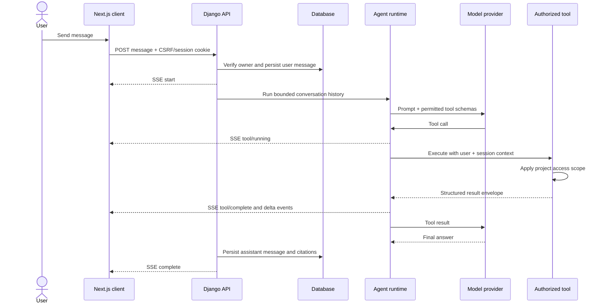
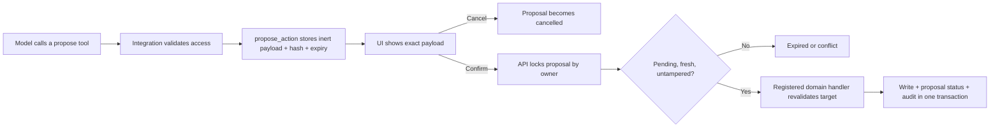

# Architecture and flow

Agent Base separates orchestration from application policy. The reusable app knows how to store a conversation, run a model/tool loop, stream progress, and confirm an action. Your project decides what data a user may read and what a confirmed action actually does.

## Components

| Component | Responsibility | Must not contain |
| --- | --- | --- |
| Next.js client | Login, session list, SSE parsing, optimistic chat UI, confirmation controls | Provider keys or authorization policy |
| Django API | Authentication boundary, ownership checks, validation, persistence, SSE response | Domain decisions hidden in serializers |
| Runtime | Bounded history, provider selection, LangGraph loop, tool event extraction | Direct business database queries |
| Tool registry | Tool discovery and permission gates | Unregistered side effects |
| Action registry | Explicit executors for confirmed proposals | Model-controlled authorization |
| Project integration | Query scoping, domain validation, writes, version checks | Trust in model-generated IDs or claims |

## Read-only message flow

The user message is persisted before the provider call. If a provider fails, the user can retry with full context and an `agent_run_failed` audit event records the error class and request ID—not the secret-bearing exception text.

## Write-action flow

A proposal is not a write. The model never invokes an action handler directly. The handler must independently re-check current permissions and compare `target_version` with current domain state; the fingerprint only detects payload mutation after proposal creation.

## Persistence

- `AgentSession`: owner, provider, title, page/domain context, latest activity
- `AgentMessage`: user/assistant/tool role, content, bounded metadata
- `AgentCitation`: normalized source details attached to an assistant message
- `AgentActionProposal`: inert payload, fingerprint, target version, TTL, execution result
- `AgentAuditEvent`: security and operational events without secrets

Deleting a session cascades to its messages, citations, and proposals. Audit events retain their record and set the session/user reference to null.

## Extension boundaries

Tools and actions are loaded from dotted module paths in `AGENT_BASE["TOOL_MODULES"]` and `AGENT_BASE["ACTION_MODULES"]`. Importing those modules registers specifications. This makes the `agentkit` package independent from your domain apps and avoids the circular imports that appear when a generic agent imports every business model.

Provider construction lives in `providers.py`. Add another adapter there or replace it with a project-level factory before expanding the allowlist. An allowlist entry without an adapter fails closed.
